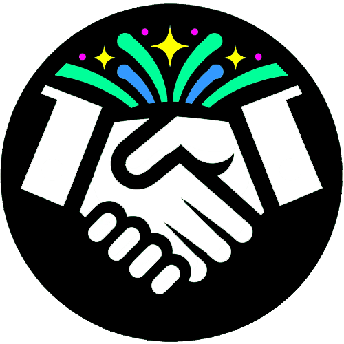
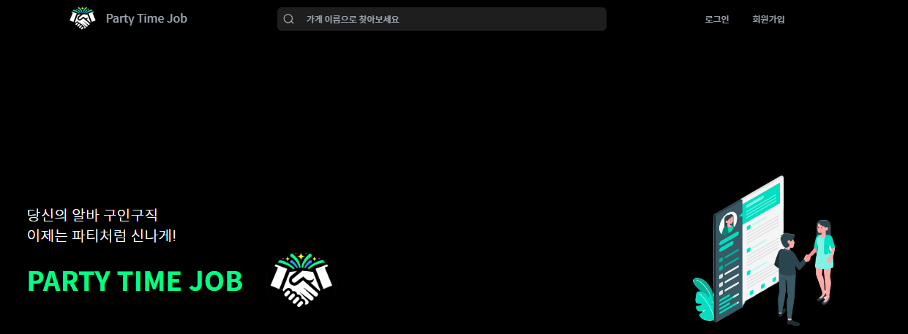
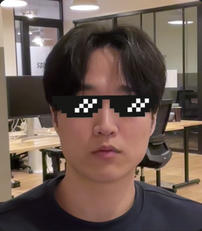

<div align='center'>
  
</div>

<br /><br />

# 프로젝트 개요



<p>일자리가 급한 사람들을 위한 구인구직 서비스. 구인구직 과정을 파티처럼 즐겁고, 더욱 쉽게 만들고자 합니다.</p>
<p>당신의 다음 파티는 어디에서 시작될까요? 지금 바로 시작해 보세요!</p>

<br /><br />

# 팀원 소개

<table>
    <tr align="center">
        <td></td>
        <td></td>
        <td></td>
        <td></td>
    </tr>
    <tr align="center">
      <td><a href="https://github.com/DanteSnow">이치현</a></td>
      <td><a href="https://github.com/siyeol97">이시열</a></td>
      <td><a href="https://github.com/yunsunglee2">이윤성</a></td>
      <td><a href="https://github.com/Crack-Egg">이재명</a></td>
    </tr>
    <tr align="center">
      <td>팀장</td>
      <td>팀원</td>
      <td>팀원</td>
      <td>팀원</td>
    </tr>
</table>

<br /><br />

# 개발 기간

### 2024.03.07 ~ 2024.03/25


<br /><br />

# 기술 스택

### 개발

<div>
  
  
  
  
</div>

<br />

### 라이브러리

<div>
  
  
  
  
</div>

<br />

### 협업

<div>
  
  
  
  
  
</div>

### 배포


<br /><br />

# FSD(Feature-Sliced Design) 폴더 구조

```bash
src
├── app
│   └─ detail
│   └─ notice
│   └─ profile
│       └── page.tsx
├── pages
│   └─ EmployerPage
│       └── api
│   └─ NoticePage
│       └── api
├── widgets
│   └─ api
│       └── getApplication.ts
│   └─ Header
│   └─ Footer
├── features
│   └─ AcceptModal
│   └─ Filter
│   └─ Sort
├── entities
│   └─ Post
│       └── hooks
│       └── utils
├── shared
│   └─ api
│   └─ hooks
│   └─ utils
│   └─ ui
│       └── Table
│       └── Button
└──     └── Input
```

<br /><br />

# 주요 기능

### 📄 랜딩페이지 및 로그인/회원가입 페이지

- 사용자 경험을 개선하기 위한 랜딩페이지 제작 및 디자인 변경
- 사장 및 알바 유형에 따른 가입 방식 선택 기능 (리액트 훅 폼)

### 📄 일반회원 페이지

- 내 프로필 등록/편집 기능 (리액트 훅 폼)
- 공고 신청 내역 렌더링 (페이지네이션)
- 신청 내역 없을 시 공고 페이지 이동 기능

### 📄 사장님 페이지

- 내 가게 등록하기 기능 (리액트 훅 폼)
- 공고 등록하기 기능 (리액트 훅 폼)
- 내 공고 클릭 시 공고 상세 페이지 이동

### 📄 공고 페이지

- 유저 지역에 따른 맞춤 공고 렌더링
- 전체 공고 렌더링 (페이지네이션)
- 전체 공고 필터 기능 (마감임박순, 시급많은순, 시간적은순, 가나다순)
- 상세 필터 기능 (위치, 시작일, 금액)
- 공고 검색 기능

### 📄 공고 상세 페이지

- 공고 지원자 목록 렌더링 (페이지네이션)
- 지원자 승인/거부 기능

### 📄 공통

- 헤더 네비게이션 바 로그인 유형에 따라 다른 메뉴 렌더링
- 헤더 공고 승인/거부 알림 모달창 팝업 기능
- 전체 UI 디자인 변경

<br /><br />
